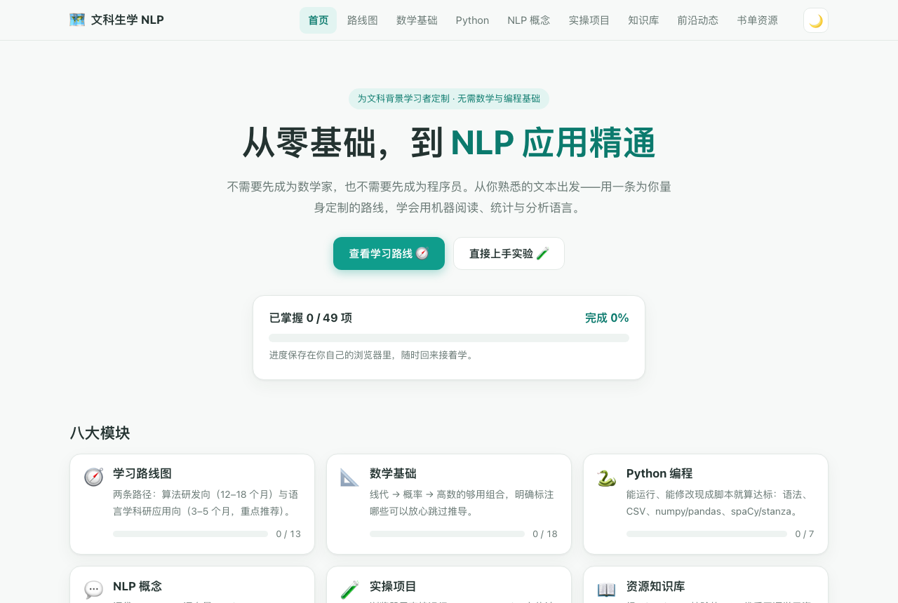

# 🗺️ 文科生学 NLP · 从零基础到应用精通的学习地图

[](https://github.com/tanyaqiong31029/nlp-learning-site/actions/workflows/ci.yml)
[](https://tanyaqiong31029.github.io/nlp-learning-site/)
[](LICENSE)
[](.github/workflows/update-data.yml)

**面向文科背景学习者的机器学习 / 深度学习个人学习网站。**

不需要先成为数学家，也不需要先成为程序员：从你熟悉的文本出发，沿着一条为语言学科研者量身定制的路线，学会用机器阅读、统计与分析语言——目标是 **3–5 个月达到研究够用水平**。



> 🔗 **在线访问**：<https://tanyaqiong31029.github.io/nlp-learning-site/>
>
> 纯静态、零运行时依赖，MIT 许可证——也可以直接下载后双击 `index.html` 在本地使用。

## ✨ 功能说明

网站共八大模块，覆盖「规划 → 学习 → 实操 → 补给」完整闭环：

| 模块 | 内容 |
| --- | --- |
| 🧭 学习路线图 | 双路径规划：**语言学科研应用向**（3–5 个月，默认突出推荐）与**算法研发向**（12–18 个月），含对比表与「先应用后理论」建议 |
| 📐 数学基础 | 按「线代 → 概率论 → 高数」优先级组织的 18 个知识点，每个标注「必学 / 推荐 / 了解 / 可跳过」并明确跳过范围 |
| 🐍 Python 编程 | 环境（Colab）、语法五件套、字符串、CSV、numpy、pandas、spaCy/stanza，代码全部可复制运行，强调「能跑、能改」 |
| 💬 NLP 概念 | 词袋、TF-IDF、词向量、Token、Transformer、上下文窗口等，全部用大白话与类比讲解，附科研者必读的「幻觉守则」 |
| 🧪 实操项目 | **浏览器内直接运行**的三个实验：TF-IDF 文本相似度（热力矩阵）、Burrows-Delta 文体计量（经典 z-score 算法）、语料统计实验台；可修改语料实时看结果，各附 Python 版脚本（可复制 / 下载 .py） |
| 📖 资源知识库 | GitHub 优质开源学习资源的结构化知识库：**31 个项目 × 7 大分类**，每条含简介、推荐理由、星标与最近更新时间，支持分类筛选与关键词搜索 |
| 📡 前沿动态 | 近期活跃项目观察、技术趋势季度评述（Agent 化、推理模型、多语言低资源……）、**热门项目活跃度实时看板**（GitHub API 实时刷新 + 12 小时缓存 + 离线回退）、前沿追踪入口 |
| 📚 书单与资源 | 为语言学研究者定制的极简清单：数学、Python、NLP、计算人文四个方向，只收真正用得上的 |

**其他特性**

- ✅ **学习进度标记**：49 个可勾选项（知识点 / 路线步骤 / 项目），按模块与整体汇总进度条，保存在浏览器 `localStorage`，页脚可一键重置
- ✅ **响应式设计**：桌面 / 移动端自适应，移动端折叠导航
- ✅ **深色模式**：跟随系统 + 手动切换
- ✅ **零依赖**：HTML + CSS + 原生 JavaScript，无框架、无构建、无外部请求（仅前沿动态看板可选调用 GitHub API）

## 🚀 安装步骤

本项目为纯静态网站，**无需安装任何依赖**，三种方式任选：

**方式一：在线访问（推荐）**

直接打开 <https://tanyaqiong31029.github.io/nlp-learning-site/>

**方式二：本地直接打开**

```bash
git clone https://github.com/tanyaqiong31029/nlp-learning-site.git
```

然后双击打开其中的 `index.html` 即可（学习进度等全部功能均可用）。

**方式三：本地服务器（体验最佳）**

```bash
git clone https://github.com/tanyaqiong31029/nlp-learning-site.git
cd nlp-learning-site
python3 -m http.server 8000
# 浏览器访问 http://localhost:8000
```

## 📖 使用方法

1. **先看[路线图](https://tanyaqiong31029.github.io/nlp-learning-site/#/roadmap)**，选好路径（多数人选应用向）；
2. **数学和 Python 交替推进**，每学完一块点击旁边的「标记已掌握」记录进度；
3. 学到第 3 个月左右，去[实操项目区](https://tanyaqiong31029.github.io/nlp-learning-site/#/projects)**换上自己的语料**做实验——三个实验在浏览器里就能跑；
4. 需要找工具、语料或进阶资源时，查[资源知识库](https://tanyaqiong31029.github.io/nlp-learning-site/#/kb)；想了解领域风向，看[前沿动态](https://tanyaqiong31029.github.io/nlp-learning-site/#/frontier)。

> 💡 页面基于 hash 路由（`#/roadmap`、`#/kb`……），可直接收藏某一页的链接。

## 🔄 内容可持续更新机制（已全自动）

本站的内容保鲜由三层机制构成，日常**零维护**：

| 层级 | 方式 | 频率 |
| --- | --- | --- |
| 实时活跃度看板 | 页面加载时调用 GitHub API 刷新星标与推送时间（12h 缓存，离线回落内置数据） | 每次访问 |
| 数据自动核验 | `update-data.yml` 工作流运行 `scripts/update-data.mjs`：核验全部仓库星标/推送、重新生成「近期动态」、自动提交并触发重新部署 | **每日 10:17（北京时间）** |
| 趋势观察 | 人工复核 `frontier.js` 的 trends 条目表述 | 每季度 |

**想收录新资源？** 在 `assets/data/knowledge.js` 对应分类添加条目（`name / repo / stars / pushed / desc / why / tags`，其中 stars 与 pushed 填当前核验值即可），下一次自动核验会把它一并纳入「近期动态」与实时看板，星标从此自动保鲜。

**手动触发**：本地运行 `node scripts/update-data.mjs`（可选 `GITHUB_TOKEN` 环境变量提升限流额度），或在仓库 Actions 页手动运行 "Auto update resource data"。


## 🛠️ 技术栈与目录结构

```
nlp-learning-site/
├── index.html              # 全部页面（hash 路由 SPA，内容与结构）
├── assets/
│   ├── style.css           # 设计令牌 + 全部样式（响应式 / 深色模式）
│   ├── core.js             # 共享基础：工具函数、存储、主题、代码块工具
│   ├── experiments.js      # 三个在线实验（相似度 / 文体计量 / 语料统计）
│   ├── content.js          # 知识库与前沿动态渲染（含实时看板网络护栏）
│   ├── app.js              # hash 路由、学习进度、页面导航、启动引导
│   └── data/
│       ├── knowledge.js    # 知识库数据（32 个资源，GitHub API 每日核验）
│       └── frontier.js     # 前沿动态数据（近期动态自动生成 / 趋势 / 实时看板）
├── scripts/
│   ├── update-data.mjs     # 数据自动核验脚本（Actions 每日运行，也可本地运行）
│   ├── validate-data.mjs   # 数据 schema 校验
│   ├── check-links.mjs     # 本地资源 + 外链检查
│   └── smoke-test.mjs      # Playwright 冒烟测试（系统 Chrome）
├── .github/workflows/
│   ├── deploy-pages.yml    # GitHub Pages 自动部署
│   ├── update-data.yml     # 每日数据自动核验 + 校验门禁 + 提交 + 触发部署
│   └── ci.yml              # CI：语法 / ESLint / HTML / schema / 链接 / 冒烟测试
├── docs/screenshot.png     # 网站截图
├── LICENSE                 # MIT
└── README.md
```

- 运行时零依赖：无框架、无构建工具；浏览器端存储使用 `localStorage`
- 中文按单字切分的 TF-IDF、字符级 Burrows' Delta（1982）均为纯 JS 实现，方便对照学习
- `devDependencies` 仅供本地检查与 CI 使用，不影响网站"双击即用"

## 🧪 开发与测试

```bash
npm install              # 安装开发工具链（仅开发用）
npm run lint             # ESLint + HTML 检查
npm run validate         # 数据 schema 校验
npm run links            # 本地资源 + 外链检查（403/429 等反爬响应记为警告）
npm run smoke            # 浏览器冒烟测试（需先起本地服务，用系统 Chrome）
npm run update-data      # 手动核验并更新资源数据
```

CI（`ci.yml`）在每次推送 / PR 时自动运行以上全部检查 + 冒烟测试，防止内容更新导致白屏、路由失效或实验回归。

## 🤝 适合谁 / 如何贡献

适合：外语、文学、语言学背景，想给研究加上「计算」翅膀的人；听说过 ChatGPT 很强但不知从何学起的人；不打算转行算法工程师、只想把数字方法用到课题里的人。

欢迎 issue 与 PR：补充资源请附上仓库链接与一句话推荐理由；若数据条目有变，请运行上方核验脚本后提交。

## 📄 License

[MIT](LICENSE) © 2026 tanyaqiong31029
